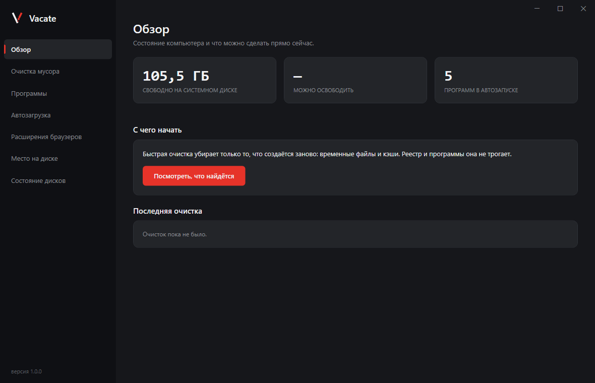

# Vacate

Утилита очистки и обслуживания Windows. По задачам — объединение возможностей
Revo Uninstaller и CCleaner: глубокое удаление программ с зачисткой остатков, очистка мусора,
управление автозагрузкой, анализ занятого места и диагностика состояния компьютера.

**[Скачать последнюю версию](https://github.com/Egor062020/Vacate/releases/latest)** —
установщик или переносимая версия. Нужна 64-разрядная Windows 10 или 11, больше
ничего устанавливать не требуется.



## При первом запуске Windows покажет предупреждение

Синее окно «Система Windows защитила ваш компьютер» появится потому, что программа
**не подписана сертификатом**. Так система реагирует на любую программу без него,
независимо от того, что она делает.

Чтобы запустить: **«Подробнее» → «Выполнить в любом случае»**.

Отдельные антивирусы тоже могут отреагировать: программа массово удаляет файлы
и правит реестр, а по поведению это похоже на вредоносное ПО. Исходный код открыт
целиком — его можно посмотреть перед запуском.

Сертификат подписи стоит денег и оформляется неделями; для открытых проектов
существует бесплатная подпись, и заявка на неё — следующий шаг.
Как устроена подпись и что программа делает с данными — в [политике подписи](SIGNING-POLICY.md).

## Что умеет

| Раздел | Что делает |
|---|---|
| Очистка мусора | Временные файлы, кэши браузеров по всем профилям, журналы Windows, отчёты о сбоях, загруженные обновления. Каждая категория отключается отдельно. Файлы моложе суток не трогаются: их может использовать работающая программа |
| Программы | Удаление с зачисткой следов: сначала штатный деинсталлятор, затем поиск того, что он оставил. Найденное показывается списком с причиной по каждому пункту — удаляется только отмеченное, каталоги уходят в карантин. Несколько программ подряд, принудительное удаление для записей без деинсталлятора, поиск программы по её окну |
| Автозагрузка | Ключи реестра, папки автозапуска, службы — с включением и отключением. Записи не удаляются, а помечаются, как в диспетчере задач. Критичные службы показаны, но защищены |
| Расширения браузеров | Chrome, Edge, Яндекс, Opera, Brave, Vivaldi, Firefox — с расшифровкой запрошенных прав |
| Место на диске | Крупные файлы, одинаковые копии, распределение по видам и карта занятого места. Удаление уходит в Корзину; файлы в облачных папках помечаются отдельно — их удаление доходит до всех ваших устройств |
| Состояние системы | Показатели накопителей — если диск молчит, так и написано. Отсюда же запускается штатная проверка целостности системных файлов |
| Настройки | Автоматическая очистка по расписанию, значок рядом с часами, проверка обновлений, язык. Всё, что программа делает без вас, включается и выключается здесь |

### Консольная версия

```
vacate-cli scan              показать, что найдено, ничего не меняя
vacate-cli clean --dry-run   полный прогон без единого изменения на диске
vacate-cli clean             выполнить очистку
vacate-cli apps              установленные программы
vacate-cli uninstall <имя>   удалить программу и убрать её следы
vacate-cli leftovers <имя>   найти следы программы, ничего не удаляя
vacate-cli startup           что стартует вместе с Windows
vacate-cli startup off <id>  отключить автозапуск (on — включить обратно)
vacate-cli extensions        расширения браузеров и их права
vacate-cli disk <папка>      куда делось место
vacate-cli health            состояние дисков
vacate-cli integrity         проверка целостности системных файлов
vacate-cli restore-point     создать точку восстановления системы
vacate-cli watch <имя>       снимок системы до установки программы
vacate-cli schedule on|off   автоматическая очистка
vacate-cli history           последние сеансы
vacate-cli undo <сеанс>      вернуть то, что можно вернуть
```

## Что можно вернуть

| Что удалено | Как вернуть |
|---|---|
| Каталоги программ и их следы | Карантин, 30 дней: `vacate-cli undo <сеанс>` |
| Ваши файлы и лишние копии | Корзина — привычным способом, программа для этого не нужна |
| Ветви реестра | Файл `.reg` рядом с журналом: открывается двойным щелчком |
| Крупные изменения системы | Точка восстановления, если защита системы включена |
| Временные файлы и кэши | **Никак.** Они создаются заново, и это сказано до нажатия, а не после |

## Чем отличается

У чистильщиков заслуженно плохая репутация: они рапортуют о выдуманных гигабайтах, ломают
работающие программы и не дают понять, что происходит. Vacate строится вокруг обратного
принципа — **честность и обратимость важнее красивых цифр**.

- **Честный счётчик.** Показывает две цифры рядом: сколько удалено и сколько **фактически**
  освободилось, с разбором расхождения. Конкуренты складывают размеры файлов из списка
  и никогда не сверяются с реальным свободным местом тома.
- **Предпросмотр — не отдельная ветка кода.** Режим «показать, что будет сделано» реализован
  подменой приёмника действий, поэтому не может разойтись с реальным выполнением.
- **Единственная дверь.** Любое разрушающее действие проходит через один шлюз с проверками.
  Другого способа удалить файл в коде просто нет.
- **Карантин вместо Корзины** для основной части операций: Корзина имеет квоту, при переполнении
  которой Windows стирает файл молча и безвозвратно.
- Программа готова сказать, что очистка не дала результата, вместо того чтобы приписать
  себе чужие гигабайты.

## Границы

Не отключает Windows Defender, UAC и настройки безопасности. Не трогает `System32`.
Критичные системные службы — только просмотр. Драйверов режима ядра не использует.

## Устройство

| Проект | Назначение |
|---|---|
| `Vacate.Abstractions` | Модель данных и контракты. Не обращается к системе |
| `Vacate.Core` | Движок выполнения планов, охрана, карантин, журнал, откат |
| `Vacate.Platform.Windows` | Единственное место работы с файловой системой и реестром |
| `Vacate.Tests` | Тесты |

Ключевые решения и обоснования — в [описании проекта](ОПИСАНИЕ-ПРОЕКТА.md).
Документ прошёл три независимых разбора; исправления по их итогам отмечены в тексте.

## Сборка

Нужен .NET 10 SDK.

```bash
dotnet build Vacate.slnx
```

```bash
dotnet test Vacate.slnx
```

Поставка (переносимый архив и установщик):

```bash
pwsh packaging\build.ps1 -Version 1.0.0 -SelfContained
```

Автономная сборка весит около 138 МБ и работает там, где .NET не установлен, —
это вариант для раздачи. Без ключа получается сборка на 1 МБ, но ей нужен
установленный .NET.

Единым файлом продукт не собирается намеренно: у графической подсистемы есть
собственные библиотеки, которые при такой сборке всё равно распаковываются
во временный каталог — тот самый, который программа чистит.

## Требования

Windows 10 или 11, 64-разрядная.

## Лицензия

[MIT](LICENSE). Выбрана в том числе потому, что бесплатная подпись кода для открытых
проектов требует лицензии, одобренной OSI. Без подписи программу, работающую с правами
администратора, раздавать нельзя: защита Windows будет предупреждать о ней каждого
нового пользователя, а часть антивирусов уберёт её в карантин по поведению.
